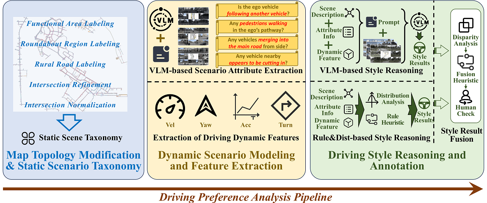
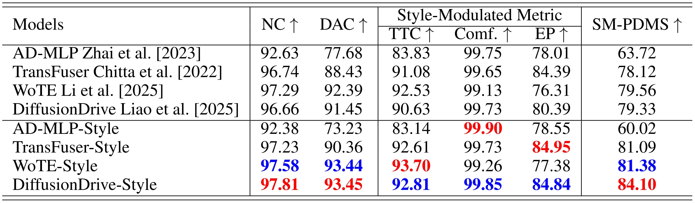

<div align="center">
<h1>StyleDrive: Towards Driving-Style Aware Benchmarking of End-To-End Autonomous Driving</h1>

[Ruiyang Hao](https://ry-hao.top/)<sup>1</sup>, [Bowen Jing](https://arthur12137.com/)<sup>2</sup>, [Haibao Yu](https://scholar.google.com/citations?user=JW4F5HoAAAAJ)<sup>1,3</sup>, [Zaiqing Nie](https://scholar.google.com/citations?user=Qg7T6vUAAAAJ)<sup>1,\*</sup>

<sup>1</sup> AIR, Tsinghua University, <sup>2</sup> The University of Manchester, <br> <sup>3</sup> The University of Hong Kong

[](https://arxiv.org/abs/2506.23982)&nbsp;
[](https://huggingface.co/datasets/Ryhn98/StyleDrive-Dataset)&nbsp;
[](https://huggingface.co/datasets/Ryhn98/StyleDrive-Dataset)&nbsp;

</div>

## News

- **` Jul. 1st, 2025`:** We release the initial version of code and weight (except for WoTE-Style model), along with documentation and training/evaluation scripts.
- **` Jun. 30th, 2025`:** We released our paper on [Arxiv](https://arxiv.org/abs/2506.23982). Code/Models are coming soon. Please stay tuned! ☕️

## Table of Contents

- [Introduction](#introduction)
- [Qualitative Results on StyleDrive Benchmark](#qualitative-results-on-styledrive-benchmark)
- [Getting Started](#getting-started)
- [Contact](#contact)
- [Acknowledgement](#acknowledgement)
- [Citation](#citation)

## Introduction

We introduce the first large-scale real-world dataset with rich annotations of diverse driving preferences, addressing a key gap in personalized end-to-end autonomous driving (E2EAD). Using static road topology and a fine-tuned visual language model (VLM), we extract contextual features to construct fine-grained scenarios. Objective and subjective preference labels are derived through behavior analysis, VLM-based modeling, and human-in-the-loop verification. Building on this, we propose the first benchmark for evaluating personalized E2EAD models. Experiments show that conditioning on preferences leads to behavior better aligned with human driving. Our work establishes a foundation for human-centric, personalized E2EAD.

<div align="center"><b>Overview and Motivation of StyleDrive.</b>

<b>Pipeline of StyleDrive Dataset Construction.</b>

</div>

## Qualitative Results on StyleDrive Benchmark

<div align="center">

<p>Qualitative illustration of DiffusionDrive-Style predictions under different style conditions
across identical scenarios. Left: Aggressive vs. Normal; Right: Conservative vs. Normal. Red
lines indicate the model’s predicted trajectory under the given style condition; green lines denote the
ground-truth human trajectory. Clear behavioral differences emerge with style variation, reflecting
the model’s ability to adapt its outputs to driving preferences.</p>
</div>

## Getting Started

- [Environment and Dataset Setup](docs/install.md)
- [Training and Evaluation](docs/train_eval.md)

## Benchmark Results



All the checkpoints are open-sourced in this [Link](https://huggingface.co/datasets/Ryhn98/StyleDrive-Dataset/).

## Contact

If you have any questions, please contact [Ruiyang Hao](https://ry-hao.top/) via email (haory369@gmail.com).

## Acknowledgement

This work is partly built upon [NAVSIM](https://github.com/autonomousvision/navsim), [Transfuser](https://github.com/autonomousvision/transfuser), [DiffusionDrive](https://github.com/hustvl/DiffusionDrive), [WoTE](https://github.com/liyingyanUCAS/WoTE), and [nuplan-devkit](https://github.com/motional/nuplan-devkit). Thanks them for their great works!

## Citation

If you find StyleDrive is useful in your research or applications, please consider giving us a star 🌟 and citing it by the following BibTeX entry.

```bibtex
 @article{hao2025styledrive,
  title={StyleDrive: Towards Driving-Style Aware Benchmarking of End-To-End Autonomous Driving},
  author={Hao, Ruiyang and Jing, Bowen and Yu, Haibao and Nie, Zaiqing},
  journal={arXiv preprint arXiv:2506.23982},
  year={2025}
}
```
